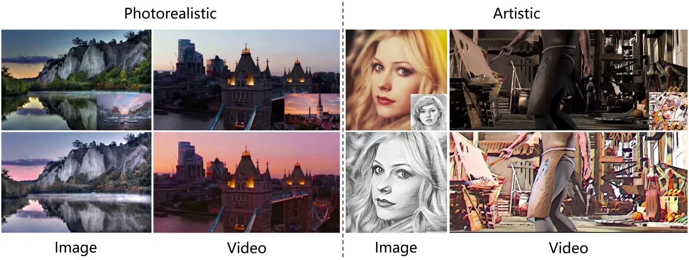
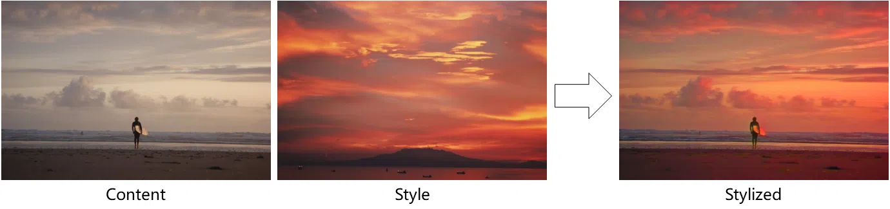
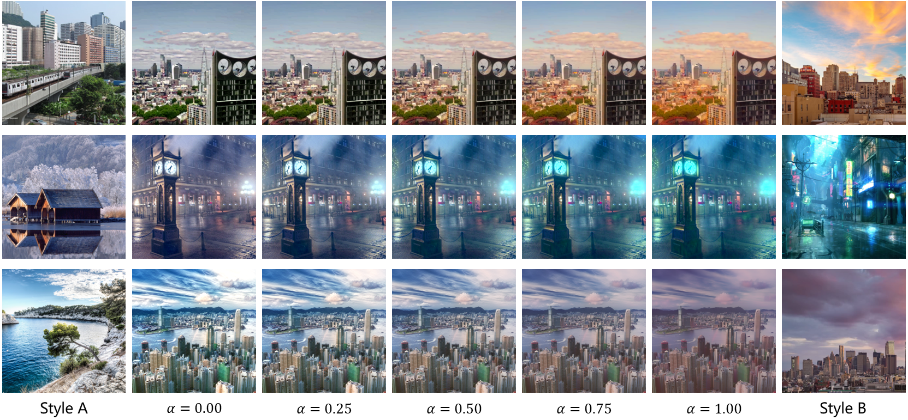
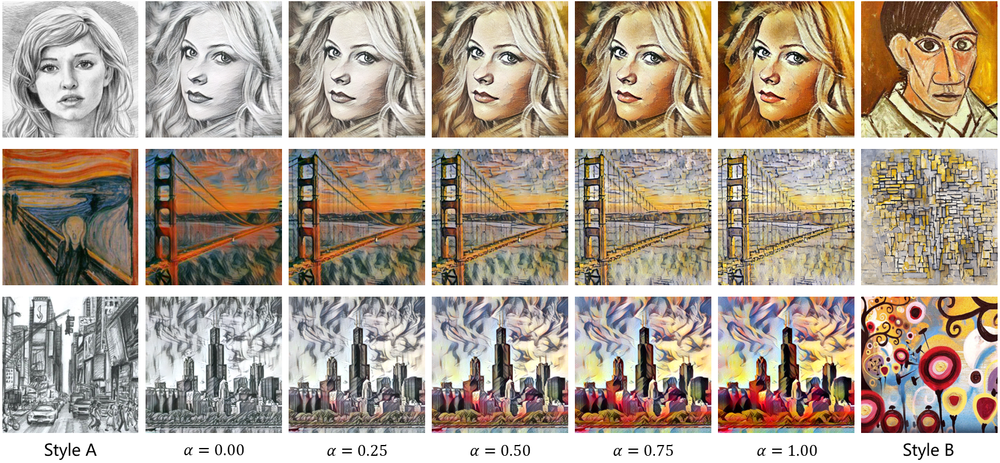

# CAP-VSTNet: Content Affinity Preserved Versatile Style Transfer (CVPR 2023)

### [**Paper**](https://arxiv.org/abs/2303.17867) | [**Video Demo**](https://youtu.be/Mks9_xQNE_8)

## Image Style Transfer
Three ways of using CAP-VSTNet to stylize images.
* Style transfer without using semantic masks.
* Style transfer with manually generated semantic masks.
* Style transfer with automatically generated semantic masks.

## Video Style Transfer
* Photorealistic video stylization and temporal error heatmap

* Artistic video stylization and temporal error heatmap

## Style Interpolation
* Photorealistic style interpolation

* Artistic style interpolation

## Ultra-resolution
An example of 4K images stylization

## Train
Available soon

## Test
Available soon

